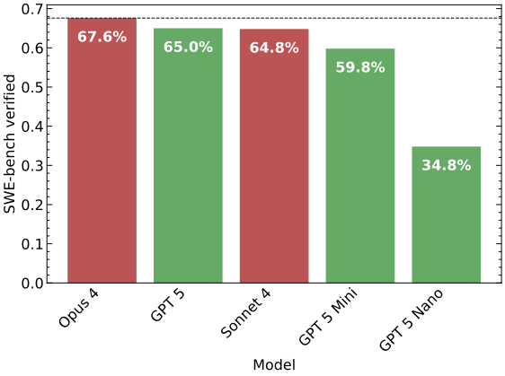
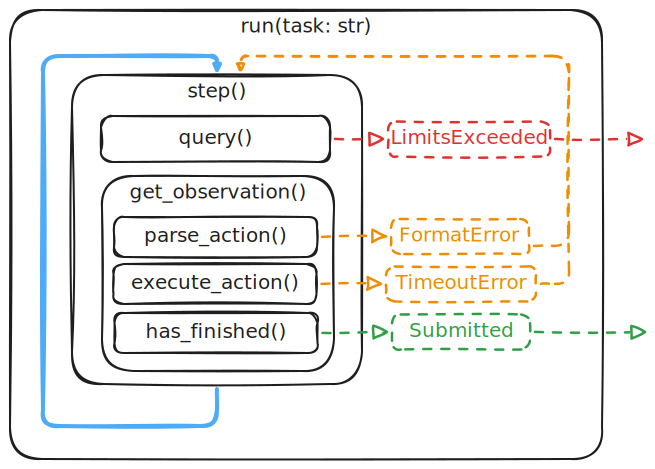
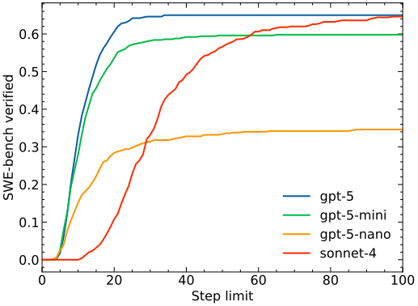
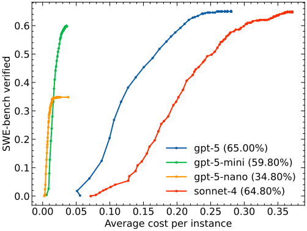
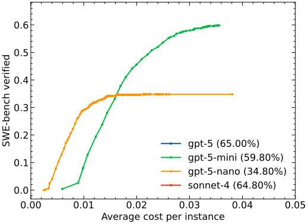

# GPT-5 on SWE-bench: Cost & performance deep-dive

This blog post covers the results of running mini-SWE-agent with GPT-5, GPT-5-mini, and GPT-5-nano.
Results will be added to the [*SWE-bench (bash-only)* leaderboard](https://swebench.com) shortly.

!!! abstract "GPT-5 is as good as Sonnet 4, but quite a bit cheaper"

    * GPT-5 is as good as Sonnet 4, but quite a bit cheaper
    * For sacrificing only a little bit of performance (5%pt), GPT-5-mini is _incredibly_ cheap
    * `GPT-5-nano` is even cheaper, I would say you pay half for half the performance
    * You can reproduce our numbers for just $18 (with GPT-5-mini) using the command at the bottom!

<!-- more -->

## SWE-bench scores

First of all, the mandatory bar chart:

<figure markdown="span">
  { width=75% }
</figure>

Immediately we can see that Anthropic's Claude Opus 4 is still unbeaten, and GPT-5 is on par with Claude Sonnet 4.
However, we're still very excited about GPT-5, and that's because of the cost!
Note that we run all `GPT-5-*` models with the default setting (verbosity and reasoning effort set to medium).
Sonnet 4 is run at zero temperature (there's no temperature for the `GPT-5-*` models).

Also note that this is a different evaluation than the one in the GPT-5 blog post, as they evaluate using
Agentless. As the name implies, this is less of an agent, but rather a RAG-based system that proposes a lot of different
"one-shot" edits out of which the best one is chosen.
This is a fantastic system, but it is also relatively complex (and all the RAG needs to be specifically engineered for each language that you're tackling).

In contrast, our `mini` agent is really just this class:

??? note "Agent class"

    - [Read on GitHub](https://github.com/swe-agent/mini-swe-agent/blob/main/src/minisweagent/agents/interactive.py)
    - [API reference](../../reference/agents/interactive.md)

    ```python
    --8<-- "src/minisweagent/agents/default.py"
    ```

??? note "Agent control flow"
    Check out the [control flow guide](../../advanced/control_flow.md) for a visual explanation of the agent's control flow following this picture:

    <figure markdown="span">
      { width=600px }
      <figcaption>The control flow of the `mini` agent</figcaption>
    </figure>

??? note "SWE-bench config"

    - [Read on GitHub](https://github.com/swe-agent/mini-swe-agent/blob/main/src/minisweagent/config/extra/swebench.yaml)

    ```yaml
    --8<-- "src/minisweagent/config/extra/swebench.yaml"
    ```

## Cost analysis

Cost is tricky to compare with agents, because *agents succeed fast, but fail slowly*.
If an agent doesn't succeed, it _should_ just continue trying until it succeeds, or hits a run time limit.
And that's (almost) what happens.

For a fair comparison, all LMs benchmarked with `mini` on our [*SWE-bench (bash-only)* leaderboard](https://swebench.com) are run with a $3 budget up to 250 steps.
However, most LMs succeed much much earlier (usually definitely before 50 steps).

Here's how this looks like:

<figure markdown="span">
  { width=75% }
  <figcaption>Agents succeed fast, but fail slowly</figcaption>
</figure>

<figure markdown="span">
  { width=75% }
  <figcaption>The same figure but zooming in on the left</figcaption>
</figure>

Right away we notice a few things:

* `GPT-5-*` shows strongly diminishing returns already after 30 steps
* Definitely don't run it for than 50 steps
* `Sonnet 4` takes more steps and only maxes out at around 100 steps

Note that for this plot, we assume that if the agent doesn't `submit` its solution by step `i`, it hasn't solved the problem yet
(this is a slight simplification, because the agent might still do extended testing after all the edits).

What does this mean for the cost?
If we look at agent performance & cost for different step limits, we get the following plot (here every point is the performance/cost at one specific step limit):

<figure markdown="span">
  { width=75% }
  <figcaption>Wow, gpt-5-mini is incredibly cheap!</figcaption>
</figure>

<figure markdown="span">
  { width=75% }
  <figcaption>Zooming in on the left</figcaption>
</figure>


Conclusions:

* `GPT-5` is cheaper than `Sonnet 4` (how much depends on how much you care about every little bit of performance)
* But `GPT-5-mini` is the real winner here! It definitely maxes out at less than 1/5th of the cost of `GPT-5` and you only sacrifice some 5%pt of performance!
* `GPT-5-nano` is even cheaper, maxing out somewhere at 1.5ct/intance!


So what's the overall takeaway?

* GPT-5 is as good as Sonnet 4, but somewhat cheaper
* For sacrificing only a little bit of performance (5%pt), GPT-5-mini is _incredibly_ cheap
* `GPT-5-nano` is even cheaper, but probably not worth it for most SWE use cases

So the real winner in my opinion is `GPT-5-mini`!

!!! tip "Want to run `mini` with GPT-5?"

    Check out our [notes](../../quickstart.md#gpt-5) on how to run `mini` with GPT-5.

    You can reproduce our numbers in this blog by following the [swebench](../../usage/swebench.md) tutorial, but
    the tl;dr is to run (remove the temperature setting from the `swebench.yaml` file first,
    because it's not supported by the `GPT-5-*` models):

    ```bash
    mini-extra swebench --subset verified --split test --shuffle \
      --model openai/gpt-5-mini -o gpt-5-mini --workers 10
    ```

    and to evaluate

    ```bash
    cd gpt-5-mini
    sb-cli submit swe-bench_verified test --predictions_path preds.json --run_id gpt-5-mini
    ```

    GPT-5-mini ran in around 1.5h for $18.
